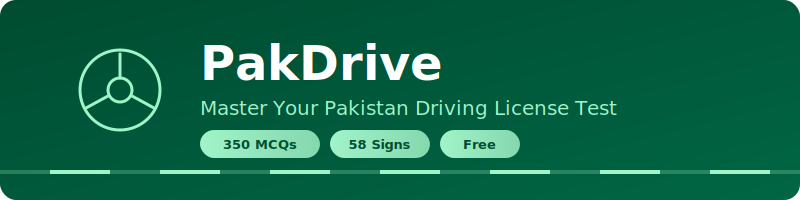

<p align="center">
  
</p>

<p align="center">
  <strong>Free, offline-ready quiz app for the Pakistan NH&MP driving license test</strong>
</p>

<p align="center">
  
  
  
  
  
</p>

---

## Features

- **350 MCQs** — Complete question bank from the NH&MP driving license test
- **58 Traffic Signs** — Visual gallery with tap-to-reveal answers
- **Mock Test Mode** — Timed 20-question tests with 60% pass threshold
- **Practice Mode** — Instant feedback, choose question count and category
- **Study Guide** — "15 Rules to Pass the Test" cheat sheet
- **Progress Dashboard** — Track scores, streaks, and mastered questions
- **Fully Offline** — No sign-up, no backend; all data in localStorage
- **Mobile-First** — Responsive design with glassmorphism nav

## Screenshots

| Home | Quiz | Dashboard |
|------|------|-----------|
| _screenshots coming soon_ | _screenshots coming soon_ | _screenshots coming soon_ |

## Quick Start

```bash
# Clone the repo
git clone <repo-url>
cd PakDrive

# Install dependencies
pnpm install

# Start dev server
pnpm dev
```

Open [http://localhost:3000](http://localhost:3000) in your browser.

## Scripts

| Command | Description |
|---------|-------------|
| `pnpm dev` | Start development server |
| `pnpm build` | Type-check and build for production |
| `pnpm preview` | Preview production build locally |
| `pnpm lint` | Run ESLint |

## Project Structure

```
PakDrive/
├── public/
│   ├── questions.json        # 350 MCQ questions
│   ├── images/               # 58 traffic sign images
│   └── logo.png
├── src/
│   ├── components/
│   │   ├── NavBar.tsx        # Glassmorphism nav with mobile menu
│   │   ├── Footer.tsx
│   │   └── ScrollToTop.tsx
│   ├── hooks/
│   │   └── useQuiz.ts        # Quiz logic, stats, localStorage
│   ├── pages/
│   │   ├── HomePage.tsx       # Landing page
│   │   ├── DashboardPage.tsx  # Progress tracking
│   │   ├── PracticePage.tsx   # Practice mode launcher
│   │   ├── SignsPage.tsx      # Traffic signs gallery
│   │   ├── MockTestLanding.tsx# Mock test info
│   │   ├── QuizPage.tsx       # Quiz engine
│   │   ├── ResultsPage.tsx    # Score & review
│   │   └── LearnPage.tsx      # Study guide
│   ├── types.ts
│   ├── App.tsx
│   ├── main.tsx
│   └── index.css              # Tailwind v4 + design tokens
├── package.json
├── vite.config.ts
└── tsconfig.json
```

## Tech Stack

| Layer | Technology |
|-------|------------|
| Framework | React 19 |
| Language | TypeScript 5.9 |
| Styling | Tailwind CSS v4 |
| Bundler | Vite 8 |
| Routing | React Router 7 |
| Storage | localStorage |
| Fonts | Manrope + Inter |
| Icons | Material Symbols |

## Design System

The app uses the **Civic Guide** design system:

- **Primary**: Deep green `#004c31` — trust and authority
- **Surface**: Off-white `#f7f9fb` — clean readability
- **Accent**: Mint `#a0f4c8` — success and progress
- **Typography**: Manrope (headings) + Inter (body)
- **Style**: No-border cards, tonal surface layering, glassmorphism nav

## License

MIT
